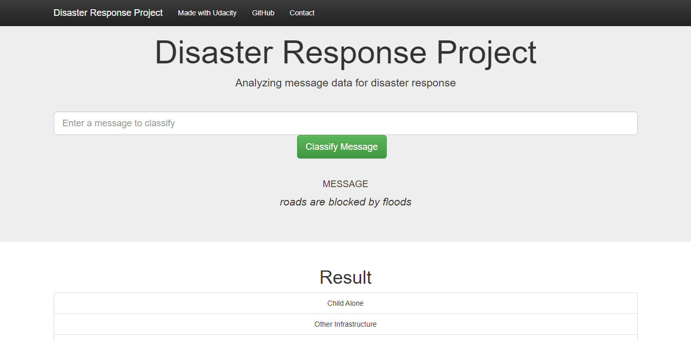
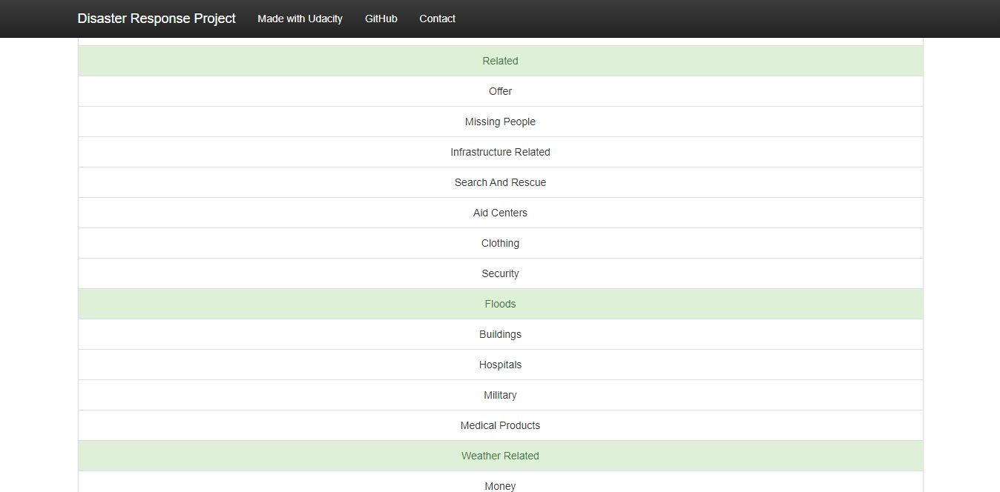
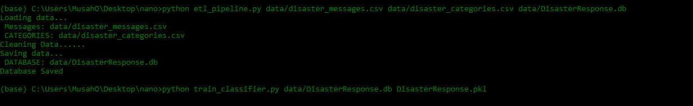
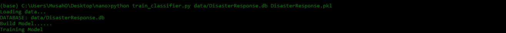
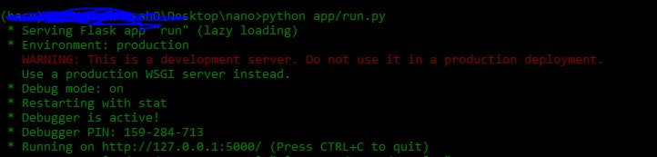
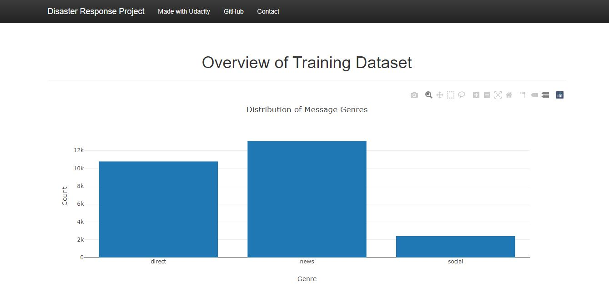
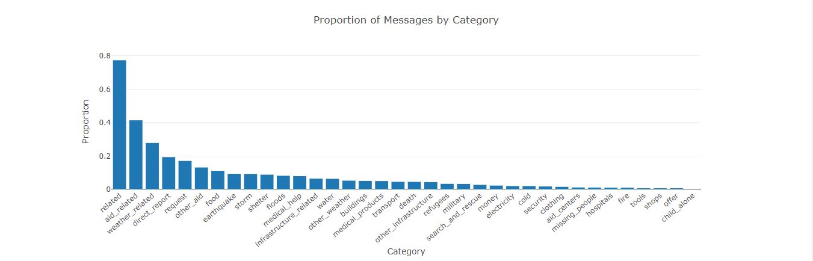

# Project: Disaster Response Pipeline

## Table of Contents

- [Project Overview](#overview)
- [Project Components](#components)
  - [ETL Pipeline](#etl_pipeline)
  - [ML Pipeline](#ml_pipeline)
  - [Flask Web App](#flask)
- [Running](#run)
  - [Data Cleaning](#cleaning)
  - [Training Model](#training)
  - [Web App](#running)
- [Conclusion](#conclusion)
- [Requirements](#requirements)
- [Credits](#credits)


<a id='overview'></a>
## 1. Project Overview

In this project, I'll apply data engineering to analyze disaster data from <a href="https://www.figure-eight.com/" target="_blank">Figure Eight</a> to build a model for an API that classifies disaster messages.

I will be creating a machine learning pipeline to categorize these events so that users can send the messages to an appropriate disaster relief agency.

The project will include a web app where an emergency worker can input a new message and get classification results in several categories. The web app will also display visualizations of the data. This project will show off my software skills, including the ability to create basic data pipelines and write clean, organized code!

**Web App**


<a id='components'></a>
## 2. Project Components

<a id='etl_pipeline'></a>

### 2.1. ETL Pipeline

The ETL script, etl_pipeline.py takes the file paths of the two datasets and database, cleans the datasets, and stores the clean data into a SQLite database in the specified database file path.

<a id='ml_pipeline'></a>

### 2.2. ML Pipeline

The machine learning script, train_classifier.py takes the database file path and model file path, creates and Builds a text processing and machine learning pipeline, trains a classifier and tunes a model using GridSearchCV, and stores the classifier into a pickle file to the specified model file path.

### 2.3. Flask Web App

The web app includes two visualizations using data from the SQLite database.

**Screenshot 1**



When a user inputs a message into the app, the app returns classification results for all 36 categories so that the appropriate relief agency can be reached out for help.

**Screenshot 2**



## 3. Running

<a id='cleaning'></a>

### 3.1. Data Cleaning

Running this command **in project directory** cleans the data:

```bat
python etl_pipeline.py data/disaster_messages.csv data/disaster_categories.csv data/DisasterResponse.db
```

disaster nessages dataset, disaster categories dataset and SQLite Database in which we want to save the cleaned data are the inputs respectively. The ETL pipeline is in _etl_pipeline.py_ script.

**Screenshot 3**



<a id='training'></a>

### 3.2. Training Model

Running THis command **in project directory** trains the model and save serialized model as pickle file:

```bat
python train_classifier.py data/DisasterResponse.db DisasterResponse.pkl
```

**Screenshot 4**




<a id='running'></a>

### 3.3. Starting the Flask web app

Running THis command **in project directory** starts the Web APP:

```bat
python app/run.py
```
**Screenshot 5**



**Screenshot 6**



**Screenshot 7**



This will direct you to a URL where you can enter messages if it doesn't type this in your broswer **http://127.0.0.1:5000/**.

<a id='conclusion'></a>

## 4. NB

The dataset is highly imbalanced 

<a id='requirements'></a>

## 5. Requirements

- Python 3.6 or above 
- necessary libraries in **requirements.txt**

<a id='credits'></a>

## 6. Credits and Acknowledgements

Thanks <a href="https://www.udacity.com" target="_blank">Udacity</a>

